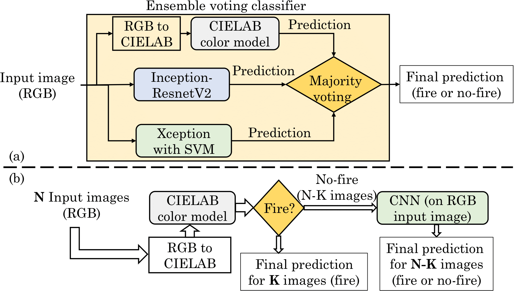
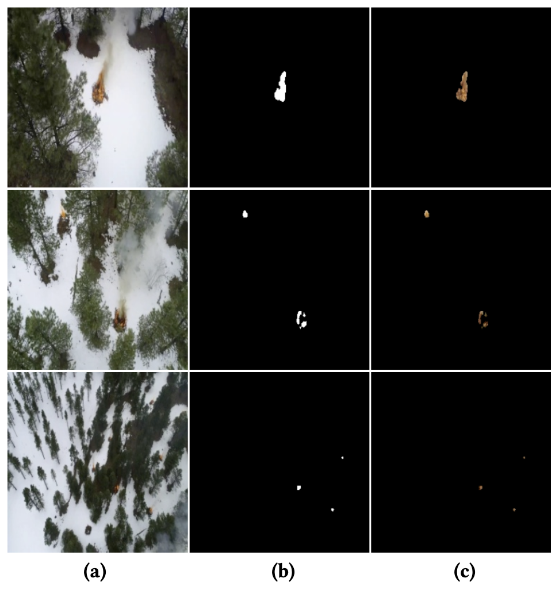
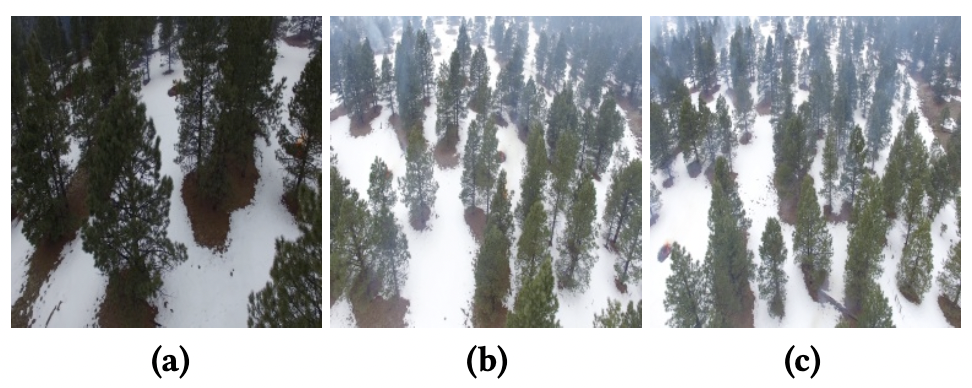

## Ensembling Deep Learning And CIELAB Color Space Model for Fire Detection from UAV images

This repository contains the source code of our paper, Ensembling Deep Learning And CIELAB Color Space Model for Fire Detection from UAV images (publication inprogress in <a href="https://dl.acm.org/conference/aimlsystems">Conference AI-ML-Systems</a>).
Wildfires can cause significant damage to forests and endanger wildlife. Detecting these forest fires at the initial stages helps the authorities in preventing them from spreading further.  In this paper, we first propose a novel technique, termed CIELAB-color technique, which detects fire based on the color of the fire in CIELAB color space. Since deep learning (CNNs) and image processing have complementary strengths, we combine their strengths to propose an ensemble architecture. It uses two CNNs and the CIELAB-color technique and then performs majority voting to decide the final fire/no-fire prediction output.
<div align='center'>
    
</div>
<hr>

### Sample results by processing in CIELAB space

<div align='center'>
    
</div>

(a) Original images from the training dataset (b) Mask made from the fire pixels identified by our proposed CIELAB color model (c) Segmented fire using original image and the mask. Evidently, our color model can extract fire pixels which may be difficult to observe by the naked eye.
<hr>

### Sample results by Ensemble Voting Technique

<div align='center'>
    
</div>

Three ‘Fire’ images that are correctly classified by ensemble voting technique but are misclassified by one of the three consitutent models. (a) Misclassified by Inception- Resnet-V2 (b) Misclassified by CIELAB model (c) Misclassified by XceptionSVM. These images prove the superiority of en- semble voting technique.
<hr>

### Project Organization

```
FireDetection
├─ .gitignore
├─ LICENSE.md
├─ README.md
├─ requirements.txt
├─ reports
│  └─ figures
│     ├─ CIELAB_results.png
│     ├─ Ensemble_Voting_Classifier.png
│     └─ Ensemble_Voting_results.png
└─ src
   ├─ __init__.py
   ├─ config.py
   ├─ data
   │  ├─ BALANCED_FLAME_DATASET
   │  │  ├─ test
   │  │  │  ├─ Fire
   │  │  │  └─ No_Fire
   │  │  └─ train
   │  │     ├─ Fire
   │  │     └─ No_Fire
   │  └─ data_generator.py
   ├─ models
   │  ├─ __init__.py
   │  ├─ ensemble.py
   │  ├─ image_processing.py
   │  ├─ network.py
   │  ├─ test_model.py
   │  ├─ train_model.py
   │  └─ trained_model
   └─ utils.py

```
## Get Started
<hr>
Dependencies:

```
pip install -r requirements.txt
```

### (Optional) Conda Environment Configuration

First, create a conda environment
```bash
conda create -n fireDetection # python=3
conda activate fireDetection
```

Now, add dependencies

Now, you can install the required packages.
```bash
pip install -r requirements.txt
```

### (Optional) Using PyCharm or DataSpell as IDE
You can add ```src``` and ```src/data``` by following steps.
1. Navigate to preferences (⌘,)
2. Select Project: workspace
3. Select Project structure
4. Then select ```src``` and mark it as source, similarly add  ```src/data``` also as source.


### Dataset

We have used FLAME dataset. You can download the dataset from <a href="https://ieee-dataport.org/open-access/flame-dataset-aerial-imagery-pile-burn-detection-using-drones-uavs">here</a>, and place it in ```data/``` directory.

### Training

Change the hyperparameters and configuration parameters according to need in ```src/config.py```.

To train CNN models, Run following command from ```/src``` directory.

```python models/train_model.py```

Both the trained model will be saved in ```models/trained_model.```

To check the classification results by image processing in CIELAB space, run following command from ```/src``` directory.


```python models/image_processing.py```

### Test performance

To test the trained model,  run following command from ```/src``` directory.

```python models/test_model.py ```

After the models have been trained and saved in ```models/trained_model```
, to check the results of ensemble voting technique, run following command from ```/src``` directory. 

```python models/ensemble.py ```

## License

CC BY-NC-ND 4.0